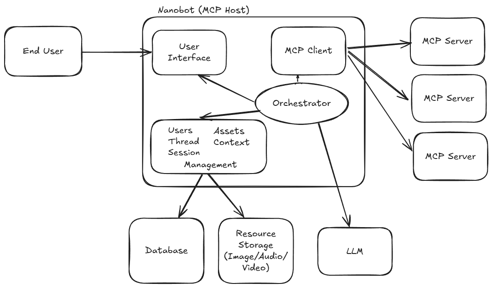

# Nanobot - Build MCP Agents

Nanobot enables building agents with MCP and MCP-UI by providing a flexible MCP host.
While existing applications like VSCode, Claude, Cursor, ChatGPT, and Goose all include an MCP host,
Nanobot is designed to be a standalone, open-source MCP host that can be easily deployed or integrated into
your applications. You can use Nanobot to create your own dedicated MCP and MCP-UI powered chatbot.

## What is an MCP Host?

An [MCP host](https://modelcontextprotocol.io/specification/2025-06-18/architecture/index#host) is
the service that combines MCP servers with an LLM and context to present an agent experience to a
consumer. The primary experience today is a chat interface, but it can be many other interfaces such
as voice, SMS, e-mail, AR/VR, Slack, MCP, or any other interface that can be used to interact with
an agent.



## Examples

Here are some examples of Nanobots in action:
- [Blackjack Game](https://blackjack.nanobot.ai) [(config)](./examples/blackjack.yaml) [(mcp source)](https://github.com/nanobot-ai/blackjack)
- [Hugging Face MCP](https://huggingface.nanobot.ai) [(config)](./examples/huggingface.yaml)
- [Shopping/Shopify](https://shopping.nanobot.ai) [(config)](./examples/shopping.yaml)

## Installation

Nanobot can be installed via [Homebrew](https://brew.sh/):

```bash
brew install nanobot-ai/tap/nanobot
```

This will give you the `nanobot` CLI, which you can use to run and manage your MCP host.

---

## Getting Started

---

## Configuration

Nanobot supports the following providers:

- **OpenAI** (e.g. `gpt-4`)
- **Anthropic** (e.g. `claude-3`)

To use them, set the corresponding API key:

```bash
# For OpenAI models
export OPENAI_API_KEY=sk-...

# For Anthropic models
export ANTHROPIC_API_KEY=sk-ant-...
```

Nanobot automatically selects the correct provider based on the model specified.

---

Create a configuration file (e.g. `nanobot.yaml`) that defines your agents and MCP servers.

**Example:**

```yaml
agents:
  dealer:
    name: Blackjack Dealer
    model: gpt-4.1
    mcpServers: blackjackmcp

mcpServers:
  blackjackmcp:
    url: https://blackjack.nanobot.ai/mcp
```

Start Nanobot with:

```bash
nanobot run ./nanobot.yaml
```

The UI will be available at [http://localhost:8080](http://localhost:8080).

---

## Development & Contribution

Contributions are welcome! Nanobot is still in **alpha**, so expect active development and rapid changes.

### Build from Source

```bash
make
```

### Working on the UI

The Nanobot UI lives in the `./ui` directory. To develop against it:

1. Remove the old build artifacts:

   ```bash
   rm -rf ./ui/dist
   ```

2. Rebuild the Nanobot binary:

   ```bash
   make
   ```

3. Start the UI in development mode:

   ```bash
   cd ui
   npm run dev
   ```

4. The UI must be served from port **5173**.\
   Nanobot runs on port **8080** and will forward UI requests to `:5173`.

---

## Features & Roadmap

Nanobot aims to be a **fully compliant MCP Host** and support all MCP + MCP-UI features.

| Feature Category           | Feature | Status        |
| -------------------------- |---------| ------------- |
| **MCP Core**               | TODO    | ✅ Implemented |
|                            | TODO    | 🚧 Partial    |
|                            | TODO    | ❌ Not yet     |
|                            | TODO    | ✅ Implemented |
| **MCP-UI**                 | TODO    | 🚧 Partial    |
|                            | TODO    | ✅ Implemented |
|                            | TODO    | ❌ Not yet     |

✅ = Implemented 🚧 = Partial / WIP ❌ = Not yet ⏳ = Planned

### Roadmap

- Full MCP + MCP-UI compliance
- More robust multi-agent support
- Production-ready UI
- Expanded model provider support
- Expanded authentication and security features
- Frontend integrations (Slack, SMS, email, embedded web agents)
- Easy embedding into existing apps and websites

---

## License

Nanobot is licensed under the [Apache 2.0 License](LICENSE).

---

## Links

- Website: [nanobot.ai](https://nanobot.ai)
- GitHub: [github.com/nanobot-ai/nanobot](https://github.com/nanobot-ai/nanobot)

# Comprehensive Guide: Building and Deploying Multi-Client AI Agents with Nanobot

## Overview

This comprehensive guide provides detailed instructions for building and deploying multi-client AI agents using the nanobot-ai/nanobot framework, covering Docker hosting, secure credential management, and usage tracking.

## Step 1: Environment Setup and Installation

### Task 1.1: Install Nanobot Framework [1](#5-0) 

### Task 1.2: Verify Installation Requirements
- Ensure Go 1.19+ is installed for building from source
- Verify Docker is installed for containerized deployments
- Check Node.js/npm availability for MCP server packages

### Task 1.3: Create Project Directory Structure
```
project/
├── nanobot.yaml
├── nanobot.env
├── profiles/
├── mcps/
└── docker/
```

### Task 1.4: Initialize Base Configuration [2](#5-1) 

### Task 1.5: Set Up Environment Variables [3](#5-2) 

**💡 Tips:**
- Use the curl installation method for quick setup on Linux/macOS
- Always verify installation with `nanobot --version`

**⚠️ Must-Do:**
- Create isolated project directories for each agent deployment
- Always use version tags in production deployments

## Step 2: Secure Credential Management

### Task 2.1: Configure API Credentials [4](#5-3) 

### Task 2.2: Set Up Environment File [5](#5-4) 

### Task 2.3: Configure Credential Isolation [6](#5-5) 

### Task 2.4: Implement Environment Variable Substitution [7](#5-6) 

### Task 2.5: Validate Credential Security
- Test credential loading without exposing sensitive values
- Verify environment isolation between different agent instances

**💡 Tips:**
- Use separate `.env` files for different environments (dev, staging, prod)
- Leverage Docker secrets for production deployments

**🚫 Must-Not-Do:**
- Never commit API keys to version control
- Avoid hardcoding credentials in configuration files

## Step 3: MCP Server Configuration

### Task 3.1: Define MCP Servers [8](#5-7) 

### Task 3.2: Configure Server Parameters [7](#5-6) 

### Task 3.3: Set Up Local MCP Servers
- Install filesystem MCP server: `npx -y @modelcontextprotocol/server-filesystem`
- Configure server paths and permissions
- Test server connectivity

### Task 3.4: Configure Remote MCP Servers [7](#5-6) 

### Task 3.5: Validate MCP Server Integration [9](#5-8) 

**💡 Tips:**
- Use environment variables for dynamic path configuration
- Test MCP servers independently before integration

**⚠️ Must-Do:**
- Always validate MCP server availability before agent deployment
- Implement proper error handling for server connection failures

## Step 4: Agent Configuration and Profiles

### Task 4.1: Define Base Agent Configuration [10](#5-9) 

### Task 4.2: Configure Agent Instructions [11](#5-10) 

### Task 4.3: Set Up Client Profiles [6](#5-5) 

### Task 4.4: Configure Profile Inheritance [12](#5-11) 

### Task 4.5: Validate Agent Configuration [13](#5-12) 

**💡 Tips:**
- Use profiles for environment-specific overrides
- Implement dynamic instructions using prompts for flexibility

**⚠️ Must-Do:**
- Always define an entrypoint in the publish section
- Test agent configurations before deployment

## Step 5: Multi-Client Publishing Setup

### Task 5.1: Configure Publishing Options [14](#5-13) 

### Task 5.2: Define Tool Publishing [15](#5-14) 

### Task 5.3: Configure Resource Publishing [16](#5-15) 

### Task 5.4: Set Up Prompt Publishing [17](#5-16) 

### Task 5.5: Configure Server Metadata [18](#5-17) 

**💡 Tips:**
- Use descriptive names and versions for published agents
- Document all published tools and resources

**🚫 Must-Not-Do:**
- Don't publish sensitive internal tools to external clients
- Avoid version conflicts in published resources

## Step 6: Usage Tracking and Logging

### Task 6.1: Configure Debug Logging [19](#5-18) 

### Task 6.2: Set Up Message Tracking [20](#5-19) 

### Task 6.3: Implement Usage Metrics [21](#5-20) 

### Task 6.4: Configure Log Forwarding [22](#5-21) 

### Task 6.5: Set Up Monitoring
- Configure log aggregation systems
- Set up alerts for error rates
- Implement usage dashboards

**💡 Tips:**
- Use `NANOBOT_DEBUG=messages,progress,log` for comprehensive debugging
- Implement structured logging for better analysis

**⚠️ Must-Do:**
- Always monitor agent performance and usage patterns
- Implement proper log rotation for production deployments

## Step 7: Docker Containerization

### Task 7.1: Create Dockerfile
```dockerfile
FROM ghcr.io/nanobot-ai/nanobot:latest
COPY nanobot.yaml /app/
COPY nanobot.env /app/
WORKDIR /app
ENTRYPOINT ["nanobot", "run", ".", "--mcp"]
```

### Task 7.2: Configure Multi-Stage Build
- Use official Nanobot base image
- Copy only necessary configuration files
- Set appropriate working directory

### Task 7.3: Set Up Environment Variables [23](#5-22) 

### Task 7.4: Configure Health Checks
- Implement readiness probes
- Set up liveness checks
- Configure startup timeouts

### Task 7.5: Optimize Image Size
- Use multi-stage builds for reduced image size
- Remove unnecessary dependencies
- Implement proper layer caching

**💡 Tips:**
- Use official base images for security and stability
- Implement proper signal handling for graceful shutdowns

**⚠️ Must-Do:**
- Always use specific version tags, never `latest` in production
- Implement proper secret management in containers

## Step 8: Container Orchestration and Deployment

### Task 8.1: Create Docker Compose Configuration
```yaml
version: '3.8'
services:
  nanobot-agent:
    image: my-nanobot-agent:latest
    environment:
      - OPENAI_API_KEY=${OPENAI_API_KEY}
    ports:
      - "8099:8099"
```

### Task 8.2: Configure Service Discovery
- Set up container networking
- Configure service mesh if required
- Implement load balancing

### Task 8.3: Set Up Volume Management
- Configure persistent volumes for logs
- Set up configuration file mounting
- Implement backup strategies

### Task 8.4: Configure Container Networking [24](#5-23) 

### Task 8.5: Implement Scaling Strategies
- Configure horizontal pod autoscaling
- Set up resource limits and requests
- Implement circuit breakers

**💡 Tips:**
- Use health checks for proper container lifecycle management
- Implement graceful shutdown handling

**🚫 Must-Not-Do:**
- Don't run containers as root user
- Avoid exposing internal ports unnecessarily

## Step 9: MCP Server Management

### Task 9.1: Configure Server Lifecycle [9](#5-8) 

### Task 9.2: Set Up Server Communication [25](#5-24) 

### Task 9.3: Implement Error Handling [26](#5-25) 

### Task 9.4: Configure Server Routing [27](#5-26) 

### Task 9.5: Set Up Server Monitoring
- Monitor server health and availability
- Track connection metrics
- Implement automatic reconnection

**💡 Tips:**
- Use stdio for local development, HTTP for production
- Implement proper timeout handling

**⚠️ Must-Do:**
- Always validate server configuration before startup
- Implement proper error recovery mechanisms

## Step 10: Production Deployment and Monitoring

### Task 10.1: Configure Production Environment [28](#5-27) 

### Task 10.2: Set Up Load Balancing
- Configure reverse proxy (nginx/traefik)
- Implement session affinity if needed
- Set up SSL termination

### Task 10.3: Configure Monitoring and Alerting [29](#5-28) 

### Task 10.4: Implement Backup and Recovery
- Set up configuration backups
- Implement disaster recovery procedures
- Test recovery processes regularly

### Task 10.5: Configure Auto-scaling
- Set up metrics-based scaling
- Configure resource thresholds
- Implement cost optimization strategies

**💡 Tips:**
- Use blue-green deployments for zero-downtime updates
- Implement comprehensive monitoring from day one

**⚠️ Must-Do:**
- Always test deployments in staging environments first
- Implement proper rollback procedures

## Configuration Templates

### Basic nanobot.yaml Template [2](#5-1) 

### Advanced Configuration Template [30](#5-29) 

## Security Best Practices

1. **Credential Management**: [4](#5-3) 
2. **Environment Isolation**: [23](#5-22) 
3. **Profile Security**: [12](#5-11) 

## Troubleshooting Guide

### Common Issues and Solutions

1. **Configuration Loading Errors**: [31](#5-30) 
2. **MCP Server Connection Issues**: [9](#5-8) 
3. **Environment Variable Problems**: [3](#5-2) 

## Performance Optimization

### Resource Management
- Configure appropriate memory limits
- Set optimal CPU allocations
- Implement caching strategies

### Scaling Considerations [32](#5-31) 

## Notes

This documentation is based on the current Nanobot framework architecture and provides comprehensive coverage of multi-client AI agent deployment. The framework is designed to be lightweight and leverage the Model Context Protocol (MCP) for extensibility. Key features include profile-based configuration management, secure credential handling, and flexible deployment options supporting both stdio and HTTP-based MCP servers.

The configuration system supports inheritance through the `extends` mechanism and profile-based overrides for different environments. Environment variable substitution provides flexibility in configuration management, while the logging system offers comprehensive debugging and monitoring capabilities.

For production deployments, consider implementing proper monitoring, backup strategies, and security measures as outlined in this guide. The framework's modular design allows for easy scaling and customization based on specific requirements.


